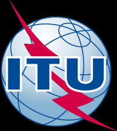
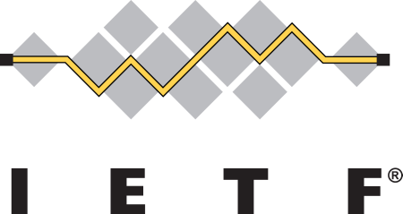

Computer Networking
========================================================
author: Jim Hogan
date: 2014-12-23
transition: fade
#incremental: true

Research Computing and Data Management
-------------------------------------------------------
[http://github.com/brianhigh/research-computing](http://github.com/brianhigh/research-computing)

<small style="font-size:.5em">
This work is licensed under a <a rel="license" href="http://creativecommons.org/licenses/by-sa/4.0/">Creative Commons Attribution-ShareAlike 4.0 International License</a>. 

</small>

Introduction
========================================================

* A 30-minute introduction
* Some historical background
* The purpose
* Evolution to contemporary computer networks
* Key technical aspects including:
  + networking topologies
  + protocols and standards 
  + networking system components
  
Networking History
================================================================
 

Networking History
================================================================

### 1792

----

### Chappe Telegraph

]

Moving Along 
================================================================

### 1889

-----

### 1943

Enter Binary
======================================================

## 10000000010111110111000000000001

Some Binary Basics
=======================================================

Recognize this number?

  128.95.112.1
  
How about this one?

  10000000010111110111000000000001

Question
==================================================================

>Would not Morse code be considered a binary communication protocol?

Computer Networks: What's the Point?
========================================================

1. Allow a computer system to communicate with another computer system
2. Allow humans to interact with computer systems
3. Allow humans to interact with other humans.*  
  
        

`*` at least for so long as the computers do not rise up and prohibit this

Contemporary Computer Networks: Key Elements
==================================================================

* Binary Operation
* Packet Switching
* Protocols

Another biggie:

* Layered Model

And some other bits:

* software and hardware components
* network topologies
* network speeds
* more...

Protocols, Standards and Governing Bodies
=============================================================
 International Telecommunicatios Union

 Internet Engineering Task Force

----

IEEE

The TCP/IP Protocol Suite
==============================================================

* Embodied in documents called "RFCs" (Request For Comment)
* Many design decisions around factors like efficiency and reliability
* Some protocols humorously start with the word "Simple" or "Lightweight"."

Questions
==============================================================
> How many different protocols are under the TCP/IP umbrella?

> What is ICANN?

Packet Switching
=============================================================

Placeholder
=============================================================

[The Internet Protocol Suite](http://en.wikipedia.org/wiki/Internet_protocol_suite)

- Computer networks:
  * Provide a means for devices to communicate
- Computing devices: 
  * Communicate by exchanging data

Networking
========================================================

- Internet
- Components
- Topologies
- Layers
- Protocols
- Speeds

Internet
========================================================

- History
- Components
- Structure ("Cloud")

Components
========================================================

- Nodes
  * hosts
  * switches
  * routers
- Links

Topologies
========================================================

- Bus
- Star
- Ring
- Mesh
- tree
- Line
- Fully connected

Network Layers
========================================================

- Link
- Internet
- Transport
- Application

Protocols/addressing
========================================================

- Ethernet
- TCP/IP
- DNS
- HTTP
- SMTP
- IMAP
- RDP

Common Network Speeds
========================================================

- Home
- Small business
- Campus
