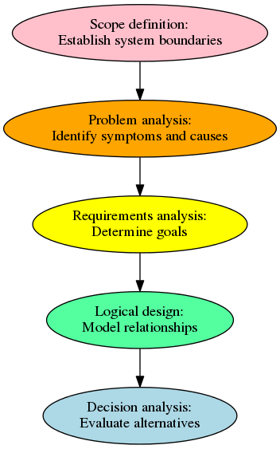

Systems Analysis
========================================================
author: Brian High
date: 2014-11-20
transition: fade

Research Computing and Data Management
-------------------------------------------------------
<small style="font-size:.7em">
Source: [http://github.com/brianhigh/research-computing](http://github.com/brianhigh/research-computing) 
License: [CC BY-SA 3.0](https://creativecommons.org/licenses/by-sa/3.0) 
</small>

Systems Development Life Cycle
========================================================
incremental: true

We will take a closer look at the **[systems analysis](http://en.wikipedia.org/wiki/Systems_analysis)** phase.

* [Planning](http://en.wikipedia.org/wiki/Systems_development_life_cycle#System_investigation) ([feasibility study](http://en.wikipedia.org/wiki/Feasibility_study))
* **[Analysis](http://en.wikipedia.org/wiki/Systems_development_life_cycle#System_analysis)**
* [Design](http://en.wikipedia.org/wiki/Systems_development_life_cycle#Design)
* [Implementation](http://en.wikipedia.org/wiki/Implementation#Information_Technology_.28IT.29)
* [Maintenance](http://en.wikipedia.org/wiki/Software_maintenance)

<small style="font-size:.7em">
Source: [Wikipedia](http://en.wikipedia.org/wiki/Systems_development_life_cycle#Phases), [CC BY-SA 3.0](http://en.wikipedia.org/wiki/Wikipedia:Text_of_Creative_Commons_Attribution-ShareAlike_3.0_Unported_License)
</small>

----

<small style="font-size:.7em">
Source: [Dzonatas, CC BY-SA 3.0, (Wikimedia)](http://commons.wikimedia.org/wiki/File:SDLC-Maintenance-Highlighted.png)
</small>

What will you need?
========================================================
incremental: true

A **primary goal** of this course is to help you develop your skills in *[requirements analysis](http://en.wikipedia.org/wiki/Requirements_analysis)*.

[Requirements analysis](http://en.wikipedia.org/wiki/Requirements_analysis) is an **essential component** of *[Systems analysis](http://en.wikipedia.org/wiki/Systems_analysis)*.

[Systems analysis](http://en.wikipedia.org/wiki/Systems_analysis) helps you **clarify your project needs** and **plan ahead** in order to obtain and allocate **critical resources**.

> If you don't *know* what you *need*, how can you *ask* for it?

Systems Analysis
========================================================
incremental: true

After completing an initial [feasibility study](http://en.wikipedia.org/wiki/Feasibility_study) to "determine if creating a new or improved system is a viable solution", proposing the project, and gaining approval from [stakeholders](http://en.wikipedia.org/wiki/Project_stakeholder), you may then conduct a [systems analysis](http://en.wikipedia.org/wiki/Systems_analysis). 

[Systems analysis](http://en.wikipedia.org/wiki/Systems_analysis) will involve "[breaking down](http://en.wikipedia.org/wiki/Work_breakdown_structure) the system in different pieces to analyze the situation, **analyzing project goals**, breaking down what needs to be created and attempting to **engage users** so that **[definite requirements](http://en.wikipedia.org/wiki/Requirements_analysis)** can be defined."

<small style="font-size:.7em">
Source: [Wikipedia](http://en.wikipedia.org/wiki/Systems_development_life_cycle#System_investigation), [CC BY-SA 3.0](http://en.wikipedia.org/wiki/Wikipedia:Text_of_Creative_Commons_Attribution-ShareAlike_3.0_Unported_License)
</small>

Systems Analysis Definition
========================================================
incremental: true

*analysis* = "to take apart"1

>[Systems analysis](http://en.wikipedia.org/wiki/Systems_analysis) is a problem solving technique that decomposes a system into its component pieces for the purpose of the studying how well those component parts work and interact to accomplish their purpose.2

We will accomplish this analysis by working through a series of [five phases](http://en.wikipedia.org/wiki/Systems_analysis#Information_technology).

<small style="font-size:.7em">
1. Source: [Wikipedia](http://en.wikipedia.org/wiki/Systems_analysis), [CC BY-SA 3.0](http://en.wikipedia.org/wiki/Wikipedia:Text_of_Creative_Commons_Attribution-ShareAlike_3.0_Unported_License)
</small>
<small style="font-size:.7em">
2. Source: *Systems Analysis and Design for the Global Enterprise 7th ed.*, by Lonnie D. Bentley, as quoted by [Wikipedia](http://en.wikipedia.org/wiki/Systems_analysis)
</small>

Systems Analysis Phases
========================================================
incremental: true

----

1. [Scope definition](http://en.wikipedia.org/wiki/Scope_%28project_management%29): Establish system boundaries
2. [Problem analysis](http://en.wikipedia.org/wiki/Problem_statement): Identify symptoms and causes
3. [Requirements analysis](http://en.wikipedia.org/wiki/Requirements_analysis): Determine goals
4. [Logical design](http://en.wikipedia.org/wiki/Systems_design#Logical_design): Model relationships
5. [Decision analysis](http://en.wikipedia.org/wiki/Decision_analysis): Evaluate alternatives

<small style="font-size:.7em">
Source: [Wikipedia](http://en.wikipedia.org/wiki/Systems_analysis#Information_technology), [CC BY-SA 3.0](http://en.wikipedia.org/wiki/Wikipedia:Text_of_Creative_Commons_Attribution-ShareAlike_3.0_Unported_License)
</small>

Scope Definition
========================================================
incremental: true

> **Scope** involves *getting information* required to start a project, and the *features* the product would have that would meet its *stakeholders requirements*.

* **Project Scope**: *work to be done*
* **Product Scope**: *desired features and functions*
    
> **Scope creep** is [...] the *incremental expansion* of the scope of a project [...], while nevertheless *failing to adjust* schedule and budget.

<small style="font-size:.7em">
Source: [Wikipedia](http://en.wikipedia.org/wiki/Scope_%28project_management%29), [CC BY-SA 3.0](http://en.wikipedia.org/wiki/Wikipedia:Text_of_Creative_Commons_Attribution-ShareAlike_3.0_Unported_License)
</small>

Problem Analysis
========================================================
incremental: true

* Define and clarify the problem
* Determine the problem's importance
* Assess the feasibility of solving the problem
* Consider any negative impacts (unintended consequences)
* Prioritize problems to solve (bottlenecks? low-hanging fruit?)
* Answer: *what*, *why*, *who*, *when*, *where*, and *how much*?
* Find **causes** (especially [root cause](http://en.wikipedia.org/wiki/Root_cause_analysis)) and **symptoms** (effects)

<small style="font-size:.7em">
Source: [Jenette Nagy, Kansas University, CC BY-NC-SA 3.0 US](http://ctb.ku.edu/en/table-of-contents/analyze/analyze-community-problems-and-solutions/define-analyze-problem/main)
</small>

Requirements Analysis
========================================================
incremental: true

* [Elicit, Analyze, and Record (EAR)](http://en.wikipedia.org/wiki/Requirements_analysis#Overview):
  * System and project [requirements](http://en.wikipedia.org/wiki/Requirements_analysis)
* Further elucidate:
  * [Measurable goals](http://en.wikipedia.org/wiki/Requirements_analysis#Measurable_goals)
  * Mission objectives.
* Output: [Requirements specification](http://en.wikipedia.org/wiki/Requirements_specification)

<small style="font-size:.7em">
Source: [Wikipedia](http://en.wikipedia.org/wiki/Requirements_analysis), [CC BY-SA 3.0](http://en.wikipedia.org/wiki/Wikipedia:Text_of_Creative_Commons_Attribution-ShareAlike_3.0_Unported_License)
</small>

----

[Types of requirements](http://en.wikipedia.org/wiki/Requirements_analysis#Types_of_Requirements):
* Operational
* [Functional](http://en.wikipedia.org/wiki/Functional_requirement)
* [Non-functional](http://en.wikipedia.org/wiki/Non-functional_requirement)
* [Architectural](http://en.wikipedia.org/wiki/Systems_architecture)
* Behavioral
* Performance
* (Others...)

Requirements Modeling: Example
========================================================
incremental: true

**Survey Data System**

Behavioral requirements ...

* **Researcher** *uploads survey*.
* **Subject** *takes survey*.
* **Subject** *uploads results*.
* **Researcher** *downloads results*.

... in **role** *goal* format.

----

[Use Case Diagram](http://en.wikipedia.org/wiki/Use_case)

<small style="font-size:.7em">
Source: [Brian High, Github](https://github.com/brianhigh/data-workshop/blob/master/images/research_survey_data_system.png), [Public Domain, CC0 1.0](http://creativecommons.org/publicdomain/zero/1.0/)
</small>

Logical Design
========================================================
incremental: true

* Abstract representation
* Data flows, entities, and relationships
* Inputs and outputs
* Graphical modeling:
  * [Data Flow Diagram (DFD)](http://en.wikipedia.org/wiki/Data_flow_diagram)
  * [Entity Relationship Diagram (ERD)](http://en.wikipedia.org/wiki/Entity%E2%80%93relationship_model)

<small style="font-size:.7em">
Source: [Wikipedia](http://en.wikipedia.org/wiki/Systems_design#Logical_design), [CC BY-SA 3.0](http://en.wikipedia.org/wiki/Wikipedia:Text_of_Creative_Commons_Attribution-ShareAlike_3.0_Unported_License)
</small>

----

[Entity Relationship Diagram](http://en.wikipedia.org/wiki/Entity%E2%80%93relationship_model)

* **Artist** *performs song*

<small style="font-size:.7em">
Source: [Bignose, Wikimedia](http://commons.wikimedia.org/wiki/File:ERD-artist-performs-song.svg), [Public Domain](http://en.wikipedia.org/wiki/Public_domain)
</small>

Logical Design: Diagrams
========================================================

Several examples of these diagrams can be found in [Systems Analysis and Design](https://github.com/brianhigh/data-workshop/blob/master/Systems_Analysis_and_Design.md).

This [tutorial](https://github.com/brianhigh/data-workshop/blob/master/Systems_Analysis_and_Design.md)1 ([PDF](https://canvas.uw.edu/courses/951183/modules/items/5479924), [HTML](https://canvas.uw.edu/courses/951183/modules/items/5479962), [MP4](https://canvas.uw.edu/courses/951183/modules/items/5479995)) provides several examples from a fictitious public health research study.

<small style="font-size:.7em">
1. See also: *[Data Management](https://canvas.uw.edu/courses/951183/modules)*, UW Canvas.
</small>

----

<small style="font-size:.7em">
Source: [Brian High, Github](https://github.com/brianhigh/data-workshop/blob/master/images/analysis_and_design.png), [Public Domain, CC0 1.0](http://creativecommons.org/publicdomain/zero/1.0/)
</small>

Decision Analysis
========================================================
incremental: true

[Decision analysis](http://en.wikipedia.org/wiki/Decision_analysis) involves ...
* Presentation of alternatives:
  * What to buy or build?
* Evaluation of alternatives:
  * Assess the "pros and cons"
  * Compare against requirements
* Make a recommendation to stakeholders
* Get a decision from stakeholders

<small style="font-size:.7em">
Source: [Wikipedia](http://en.wikipedia.org/wiki/Decision_analysis), [CC BY-SA 3.0](http://en.wikipedia.org/wiki/Wikipedia:Text_of_Creative_Commons_Attribution-ShareAlike_3.0_Unported_License)
</small>
